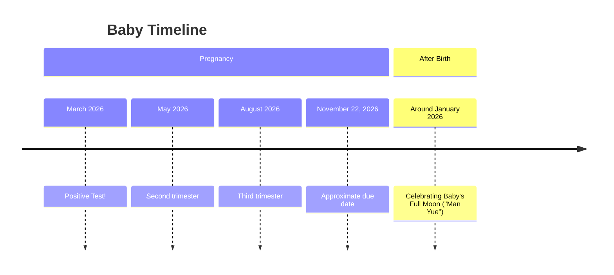

We are so lucky to be surrounded by lovely friends and family who are looking for a chance to celebrate with us. For this reason, we wanted to put together some information since folks may not be familiar with all of the traditions and customs around the birth of babies which I grew up with in Taiwan.
## Timeline

### No Baby Shower or Gifts before Birth

The big difference from what you may be use to is that we will not be holding a baby shower before the birth. In my culture, it is bad luck to celebrate the baby too early either by holding an event or accepting gifts before the birth.

Instead we will be inviting folks to drop by for an Open House at our place to celebrate the first milestone of the baby's life, **Man Yue**, or Baby's Full Moon.

More details to come when we have confirmed the details.
## No Baby Registry

We would prefer to observe the traditions of **Red Envelopes**, for this reason we have not set up a baby registry. A red envelope is not just about money: a red envelope is a way to provide a blessing to baby for their future. The red of the envelope itself represents **energy, protection, and good fortune**. The value inside the envelope also have symbolic meaning. There are some specific guidelines for preparing a red envelope to ensure maximum blessings to the baby, however, we are equally grateful just for your presence in celebrating with us.
### Guidelines for Preparing a Red Envelope

- Use new, crisp bills, if possible, and avoid including coins, in brand new traditional red envelope or **hong bao**
- Hand it over with both hands
- Please avoid the number 4 as it is a homophone for "death".
- You can see the table below for examples of target amounts and the denominations to use and their meaning. Honestly though, don't overthink it!

| Target Amounts | Denominations                                     | Meaning                                                                                                                                    |
| -------------- | ------------------------------------------------- | ------------------------------------------------------------------------------------------------------------------------------------------ |
| $20            | 1 x $20                                           | 2 is an even digit; means double blessings and harmony                                                                                     |
| $60            | $50 bill + $10 bill                            | The $50 bill is red, which makes it more auspicious, but the $10 makes the total contain the number 6, means "going smoothly."             |
| $80            | $50 bill + $20 bill + $10 bill                 | While 4 x $20 can reach $80, it requires 4 bills which is unlucky. Number 8 represents luck and wealth. $50 bill is red, which is lucky.   |
| $160           | 3 x $50 + 1 x $10 1 x $100 + 1 x $50 + 1 x $10 | $50 bill is red. $100 is gold. Both are lucky colours. This total with the number 6 means "May everything in the baby's life go smoothly." |
