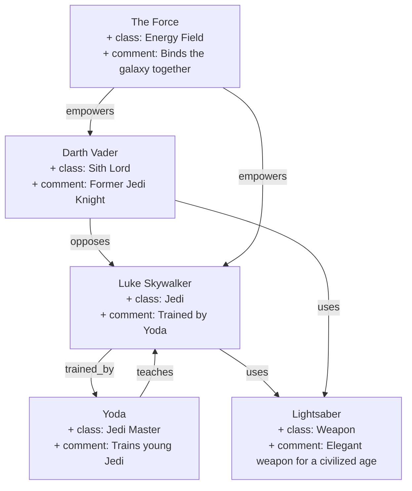

This is going to be a short one[^1] because I'm a bit under the weather and I should be studying for my French class test on Wednesday.
## Highlights

### The Perfect Month

First, I realized along with many others that it's a perfect February.

<figure>
  
  <figcaption>Screenshot of a post by user @Rainmaker1973 "February 2026 is officially being dubbed a "Perfect Month" because it starts on a Sunday and ends on a Saturday, fitting perfectly into four complete rows on a standard calendar."</figcaption>
</figure>

### Mr. Worldwide

It was a great week for making  informal connections internationally:
1. My team had the chance to connect with folks working on the [National Data Library: progress update, January 2026 - GOV.UK](https://www.gov.uk/government/publications/national-data-library-progress-update-january-2026/national-data-library-progress-update-january-2026) to share experiences. More thinking to following in the coming months on imagining more integrated data services for the GC.
2. Connected with someone from the Queensland (Australian) government who is also looking at creating community, informal spaces for people to connect. She shared some really neat content her team developed on [collaborating in government](https://www.forgov.qld.gov.au/service-design-and-delivery/governance-and-collaboration/collaborating-in-government).

Both conversation highlighted that talking to likeminded people is really important because solutions exist, we can learn from one another's successes/failures, and we are not alone. Put another way... we are rarely as unique as we'd like to think we are - and that's a good thing.
### Automating Stakeholders Mapping

There's almost no consistency in what software is allowed in which department[^2], except for the choke hold the Microsoft suite[^3] keeps the world in. Because of this, I've been a lot of different attempts to do mapping using various drawing or diagramming tools, many of which require hardcoding in label that are frequently lost when exported into images or PDFs.

As a result, my preference would be for wider adoption of text based diagramming through [mermaid.js](https://mermaid.js.org/)  or similar. The benefits are:
- stores diagrams in a way which is easily modifiable;
- can be stored in plaintext format[^4] whose content can be opened and read meaningfully regardless of future software availability to render it graphically;
- can be styled using CSS instead of messing with a UI.

The problem is that anything that resembles coding seems to cause fear and assumption of a large learning curve compared to the graphic user interfaces with drag and drop features that we are accustomed to[^5].

As a compromise, I wanted to make something that could automatically produce the graph in the format I prefer for that task at hand (stakeholder mapping) while sticking to the familiar M365 suite that every single one of my colleagues would have access to without going through their IT. This week I made a tool that takes 2 simple excel tables (one with "Entities" and one with "Relationships") and turns it into Mermaid code.

Download it here: [GitHub - heidiwwang/mermaid\_excel: A simple excel based tool to generate a relationship graph out of tables.](https://github.com/heidiwwang/mermaid_excel)

Here's an example graph to show what the tool produces:

## Frustrations

1. RTO4[^6] .

2. Cynicism, defeatism, nihilism, or whatever, and the performance of it. My previous role, I would characterize as having a bit of a culture of toxic positivity.  My current, I'm feeling like there's a learned helplessness that is enforced socially and any attempt to be hopeful is mocked, treated as naive, or ignored. And it's somehow linked to making decisions on vibes rather than evidence. Insisting on replicating existing methods that have been shown not to work so as to preemptively sabotage efforts for improvement? To be investigated further. What seems apparent is that my optimistic outlook[^7] seems to make people who have less experience successfully doing transformative work in a government context than me talk to me like I'm a baby gazelle wobbling through my first steps[^8].

[^1]: In my defense, it's not as long as it could have been. I was optimistic when I wrote that sentence earlier today.
[^2]: See also: [Is this blocked in my department.ca](https://isthisblockedinmydepartment.ca/) and [Should it be blocked in my department?](https://shoulditbeblockedinmydepartment.ca/)
[^3]: Shared without commentary:
	1. [German state gov. ditching Windows for Linux, 30K workers migrating - Ars Technica](https://arstechnica.com/information-technology/2024/04/german-state-gov-ditching-windows-for-linux-30k-workers-migrating/);
	2. [ZenDIS, openDesk, and openCode: How Germany is transforming their public sector with open source \| We Love Open Source • All Things Open](https://allthingsopen.org/articles/zendis-opendesk-opencode-public-sector-open-source);
	3. [France ditches Zoom and Teams](https://www.bnnbloomberg.ca/business/2026/02/03/france-ditches-zoom-and-teams-for-homegrown-system-amid-european-digital-sovereignty-push/);
	4. [Digital Sovereignty: A Framework to improve digital readiness of the Government of Canada](https://www.canada.ca/en/government/system/digital-government/digital-government-innovations/cloud-services/digital-sovereignty/digital-sovereignty-framework-improve-digital-readiness.html)
[^4]: I feel that markdown and other plaintext format should be the standard to ensure long term availability of government documents for archival purposes per [Guidelines on File Formats for Transfer](https://www.canada.ca/en/library-archives/services/government/information-disposition/management/guidelines/file-formats-transfer.html)
[^5]: One could argue that the majority of non-specialist software company are just selling opinionated UX/UI applied over the same few free and open source software that's been available since computers . Important foundational reading: [Paul Ford: What Is Code? \| Bloomberg](https://www.bloomberg.com/graphics/2015-paul-ford-what-is-code/)
[^6]: [No desks, no strategy: Experts say government's latest return-to-office order ignores reality \| CBC News](https://www.cbc.ca/news/canada/ottawa/no-desks-no-strategy-experts-say-government-s-latest-return-to-office-order-ignores-reality-9.7077299)
[^7]: Strategically chosen because I've learned that if I matched the level of pessimism others assume, it becomes an echo chamber of depression and inaction.
[^8]: The bar continues to move: "Oh you have 13 years in government? Talk to me when you have 15... 20... 25... 30..." . Maybe it's not actually about my age or years of experience.
